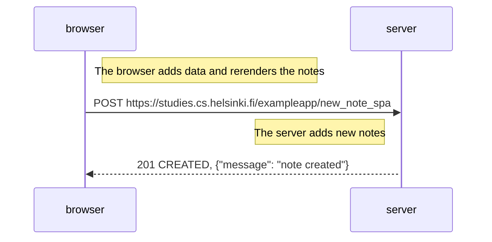

```mermaid
sequenceDiagram
    participant browser
    participant server

    Note right of browser: The browser adds data and rerenders the notes

    browser->>server: POST https://studies.cs.helsinki.fi/exampleapp/new_note_spa
    activate server

    Note left of server: The server adds new notes

    server-->>browser: 201 CREATED, {"message": "note created"}

```